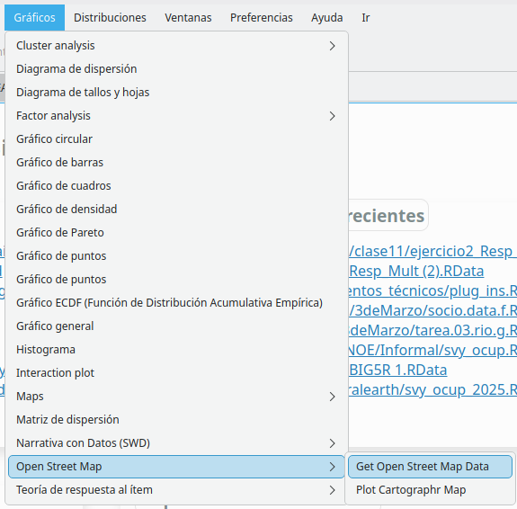
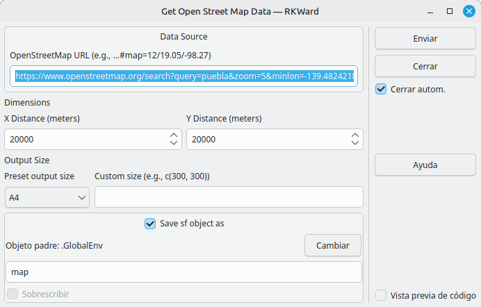
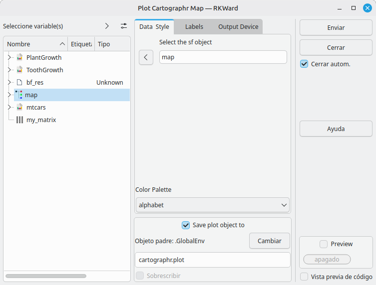
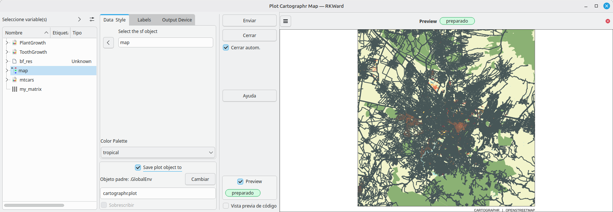

# rk.cartographr


[](https://github.com/AlfCano/rk.cartographr/actions/workflows/lintr.yml)


An RKWard plugin package for creating beautiful maps using the `cartographr` R package. This plugin provides a graphical user interface (GUI) to fetch data from OpenStreetMap and generate customizable map plots directly within RKWard.

## Features

-   **Fetch OSM Data:** Easily download map data by simply pasting a URL from OpenStreetMap.
-   **Plotting Component:** A dedicated interface for generating the map from the fetched `sf` object.
-   **Live Preview:** Interactively see how your map will look before submitting the final code.
-   **Customization:**
    -   Choose from a list of validated color palettes from the `cartographr` package.
    -   Add custom titles, subtitles, axis labels, and captions.
    -   Fine-tune the output device settings (PNG, JPG, SVG), including resolution, dimensions, and background color.

## Installation

You can install this plugin package directly from GitHub using the `devtools` package in R.

```{r}
# install.packages("devtools") # If you don't have it installed
devtools::install_github("AlfCano/rk.cartographr")
```

After installation, restart RKWard for the plugin to appear in the menus.

  
  
  *Screenshot of the path in the main menu.*

## Usage Workflow

The workflow is designed in two main steps: first fetching the data, then plotting it.

### Step 1: Get Open Street Map Data

1.  Navigate to the RKWard menu: `Plots` -> `Open Street Map` -> `Get Open Street Map Data`.
2.  Paste the full URL from OpenStreetMap (e.g., `https://www.openstreetmap.org/#map=12/19.0537/-98.2775`) into the **OpenStreetMap URL** field. The plugin will automatically parse the latitude and longitude.

  

*Screenshot of the RKWard interface operating the rk.cartographr Map Obtaining module, showing the Data Source configuration and Dimensions selection.*

3.  Adjust the **X Distance** and **Y Distance** (in meters) to define the map area you want to capture.
4.  Optionally, change the output size or the name of the object to be saved (it defaults to `map`).
5.  Click `Submit`. This will run the `get_osmdata()` function and create an `sf` object in your R environment.

### Step 2: Plot Cartographr Map

1.  Navigate to the RKWard menu: `Plots` -> `Open Street Map` -> `Plot Cartographr Map`.
2.  In the **Data & Style** tab, select the `sf` object you just created (e.g., `map`) from the data selector.

  

*Screenshot of the RKWard interface operating the rk.cartographr Choropleth Maps module, showing spatial join configuration and palette selection.*

3.  Choose your desired **Color Palette**. The preview pane on the right will update automatically.

  
  
*Screenshot of the rendering device showing the output of the resulting thematic map, with cartographic aesthetic elements ready for publication.*

4.  Use the **Labels** tab to add a title, subtitle, or caption to your map.
5.  Use the **Output Device** tab to control the properties of the final image file, such as resolution and dimensions.
6.  Click `Submit` to generate the final plot in the RKWard output window.

## Dependencies

This plugin requires the following R packages to be installed:

-   `cartographr`
-   `sf`
-   `ggplot2`

## Author

Alfonso Cano Robles (`alfonso.cano@correo.buap.mx`)
With assitance of Gemini a LLM from Google.

## License

This plugin is licensed under the GPL (>= 3).
